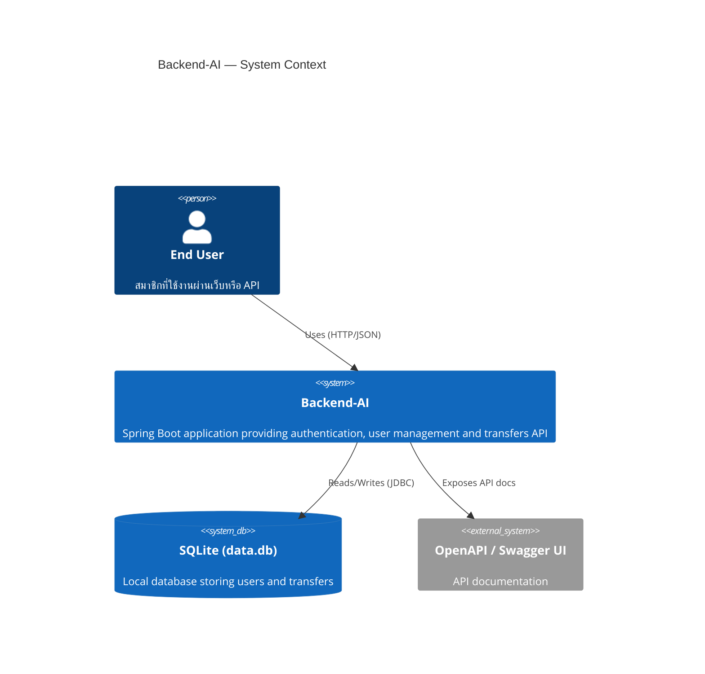
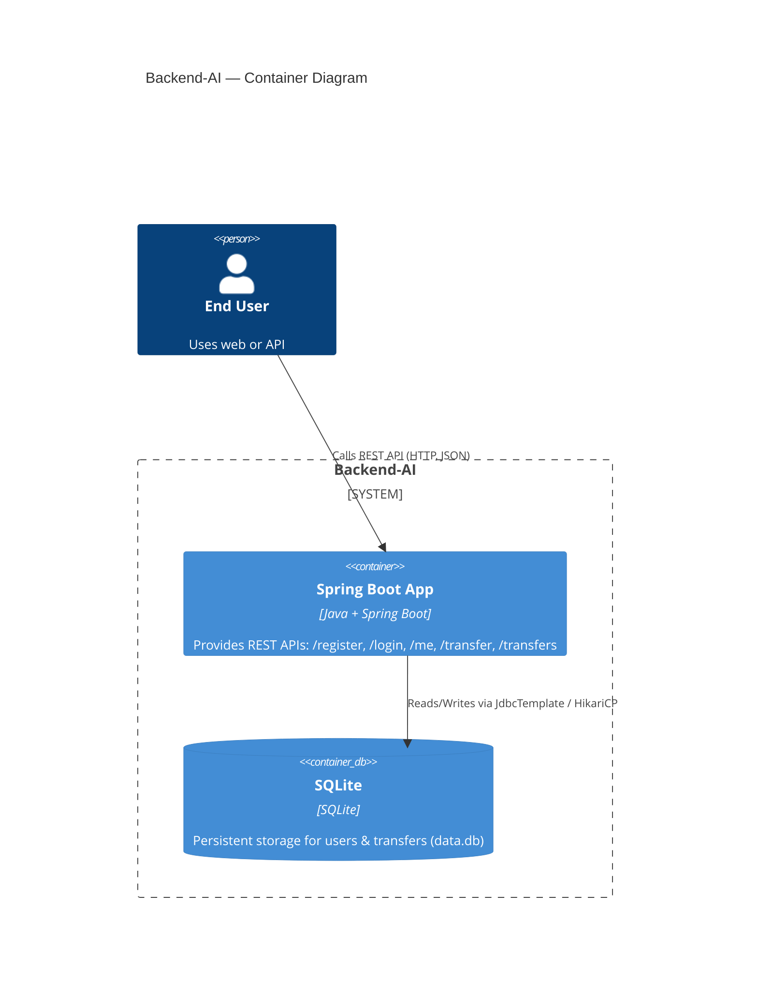
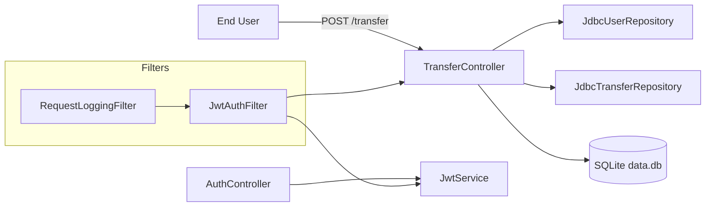

# C4 Architecture (Mermaid)

สรุปสถาปัตยกรรมของระบบ Backend-AI ในรูปแบบ C4 (Mermaid) — ประกอบด้วย System Context, Container, และ Component diagrams

> หมายเหตุ: GitHub/GitHub Pages' Mermaid renderer ไม่รองรับส่วนขยาย C4 (C4Context / C4Container / C4Component) ทำให้เกิดข้อผิดพลาด "Cannot read properties of undefined (reading 'x')" ขณะเรนเดอร์.
> ดังนั้นด้านล่างผมคงไว้แต่บอกว่าเป็น C4 แต่อยู่ในบล็อก "Preview (C4)" เท่านั้น และแสดง Diagrams แบบสำรองโดยใช้ Mermaid flowchart (graph LR) ที่ GitHub จะเรนเดอร์ได้ปกติ

---

## Preview (C4) — อาจไม่สามารถเรนเดอร์บน GitHub
(ถ้าไม่แสดง ให้ดูแผนผังสำรองด้านล่าง)





```mermaid
C4Component
title Backend-AI — Component Diagram (Transfer-related)
Container(app, "Spring Boot App", "Java + Spring Boot")

Component(authController, "AuthController", "REST Controller", "/register, /login, /me")
Component(transferController, "TransferController", "REST Controller", "POST /transfer, GET /transfers — handles validation and transaction")
Component(jwtFilter, "JwtAuthFilter", "Security Filter", "Parses Authorization: Bearer <token>, sets Authentication principal")
Component(jwtService, "JwtService", "Service", "Generate and validate JWTs; extract userId")
Component(requestLogger, "RequestLoggingFilter", "Servlet Filter", "Logs request pre/post; helpful for debugging and audit")
Component(userRepo, "JdbcUserRepository", "Repository", "CRUD and adjustPoints via JDBC")
Component(transferRepo, "JdbcTransferRepository", "Repository", "Persist transfer records")
Component(sqlite, "SQLite (data.db)", "Database", "users and transfers tables")

Rel(user, transferController, "Calls POST /transfer")
Rel(transferController, userRepo, "Loads users and adjustPoints (within @Transactional)")
Rel(transferController, transferRepo, "Saves transfer record")
Rel(jwtFilter, jwtService, "Validates token")
Rel(jwtFilter, userRepo, "Loads authenticated User by id")
Rel(authController, jwtService, "Generates JWT on successful login")
Rel(transferController, sqlite, "Indirect via repositories (JdbcTemplate)")
Rel(app, requestLogger, "Request filter runs around controllers")
```

---

## Fallback diagrams (GitHub-friendly)

ใช้ flowchart/graph syntax ของ Mermaid ซึ่ง GitHub สามารถเรนเดอร์ได้โดยตรง

### System Context (flowchart)

```mermaid
flowchart LR
  U[End User]\n(สมาชิก) -->|HTTP/JSON| B[Backend-AI\n(Spring Boot)]
  B -->|JDBC| DB[(SQLite data.db)]
  B -->|API docs| S[Swagger / OpenAPI]
```

### Container Diagram (flowchart)

```mermaid
flowchart LR
  U[End User] -->|Calls REST API| APP[Spring Boot App\n(REST endpoints: /register, /login, /me, /transfer, /transfers)]
  APP -->|Reads/Writes| DB[(SQLite data.db)]
```

### Component Diagram (flowchart) — transfer flow



หมายเหตุการแก้ปัญหา:
- ข้อความแสดงข้อผิดพลาด "Cannot read properties of undefined (reading 'x')" เกิดจาก renderer ของ GitHub ที่ไม่รองรับไวยากรณ์ C4 ของ Mermaid
- ทางแก้ที่ปลอดภัย: ใช้ flowchart (graph LR / flowchart LR) ที่เป็นไวยากรณ์มาตรฐานของ Mermaid ซึ่ง GitHub รองรับ

ถ้าต้องการ ผมจะแปลงบล็อก Mermaid แต่ละอันเป็นไฟล์ SVG/PNG ให้ และเพิ่มไฟล์ภาพลงใน repo (commit + push) — บอกหมายเลข:
1) แปลงเป็น SVG แล้ว commit+push ไฟล์ภาพ
2) แปลงเป็น PNG แล้ว commit+push
3) แปลงและสร้าง draw.io-friendly SVG (group/ungroup) และ commit+push
4) แค่นี้พอแล้ว
