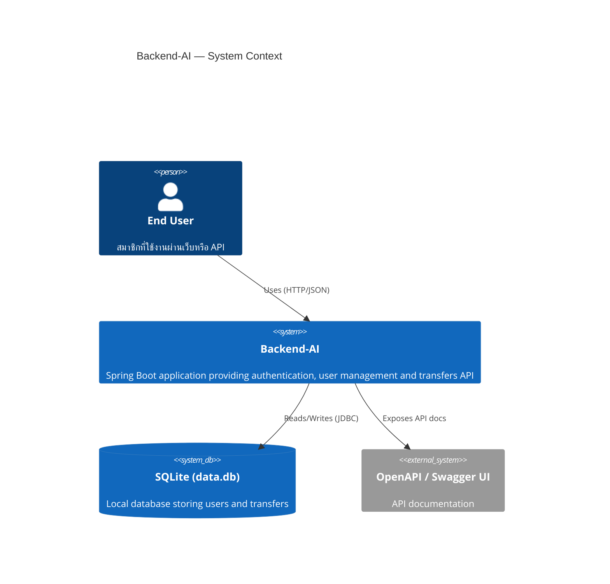
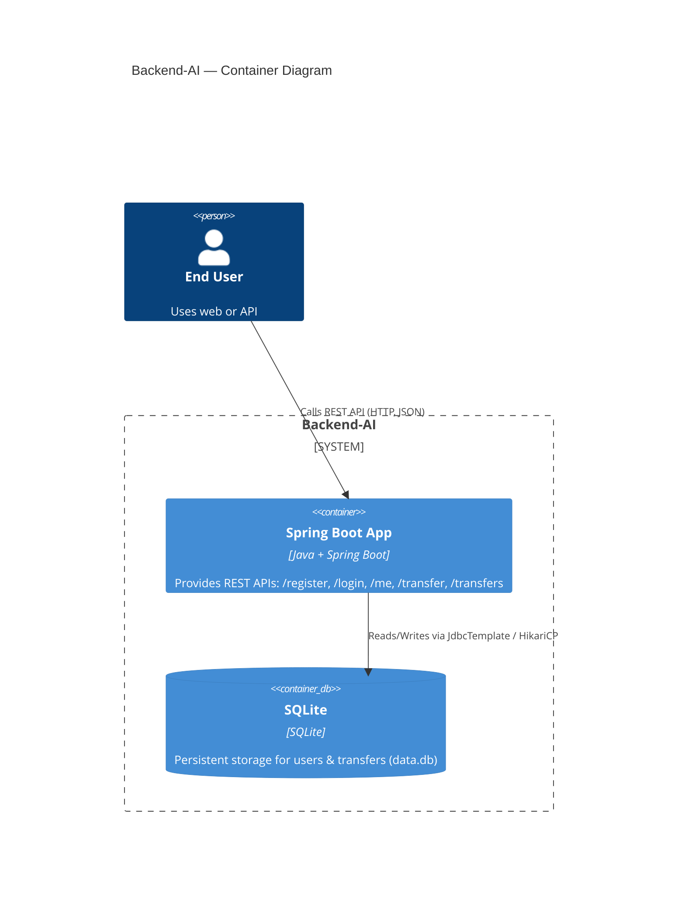

# C4 Architecture (Mermaid)

สรุปสถาปัตยกรรมของระบบ Backend-AI ในรูปแบบ C4 (Mermaid) — ประกอบด้วย System Context, Container, และ Component diagrams

## System Context



## Container Diagram



## Component Diagram (สำคัญ: transfer flow)

```mermaid
C4Component
title Backend-AI — Component Diagram (Transfer-related)
Container(app, "Spring Boot App", "Java + Spring Boot")

Component(authController, "AuthController", "REST Controller", "/register, /login, /me")
Component(transferController, "TransferController", "REST Controller", "POST /transfer, GET /transfers — handles validation and transaction")
Component(jwtFilter, "JwtAuthFilter", "Security Filter", "Parses Authorization: Bearer <token>, sets Authentication principal")
Component(jwtService, "JwtService", "Service", "Generate and validate JWTs; extract userId")
Component(requestLogger, "RequestLoggingFilter", "Servlet Filter", "Logs request pre/post; helpful for debugging and audit")
Component(userRepo, "JdbcUserRepository", "Repository", "CRUD and adjustPoints via JDBC")
Component(transferRepo, "JdbcTransferRepository", "Repository", "Persist transfer records")
Component(sqlite, "SQLite (data.db)", "Database", "users and transfers tables")

Rel(user, transferController, "Calls POST /transfer")
Rel(transferController, userRepo, "Loads users and adjustPoints (within @Transactional)")
Rel(transferController, transferRepo, "Saves transfer record")
Rel(jwtFilter, jwtService, "Validates token")
Rel(jwtFilter, userRepo, "Loads authenticated User by id")
Rel(authController, jwtService, "Generates JWT on successful login")
Rel(transferController, sqlite, "Indirect via repositories (JdbcTemplate)")
Rel(app, requestLogger, "Request filter runs around controllers")
```

หมายเหตุสั้นๆ:
- การโอนแต้ม (transfer) ต้องทำเป็น transaction เดียว: ลดแต้มผู้ส่ง, เพิ่มแต้มผู้รับ, บันทึกรายการในตาราง transfers
- JwtAuthFilter ทำหน้าที่แปลง token -> user principal ก่อนเข้าถึง Controller
- สามารถนำ Mermaid C4 blocks นี้ไปเปิดบน mermaid.live หรือแปลงเป็น SVG เพื่อใช้งานใน draw.io
