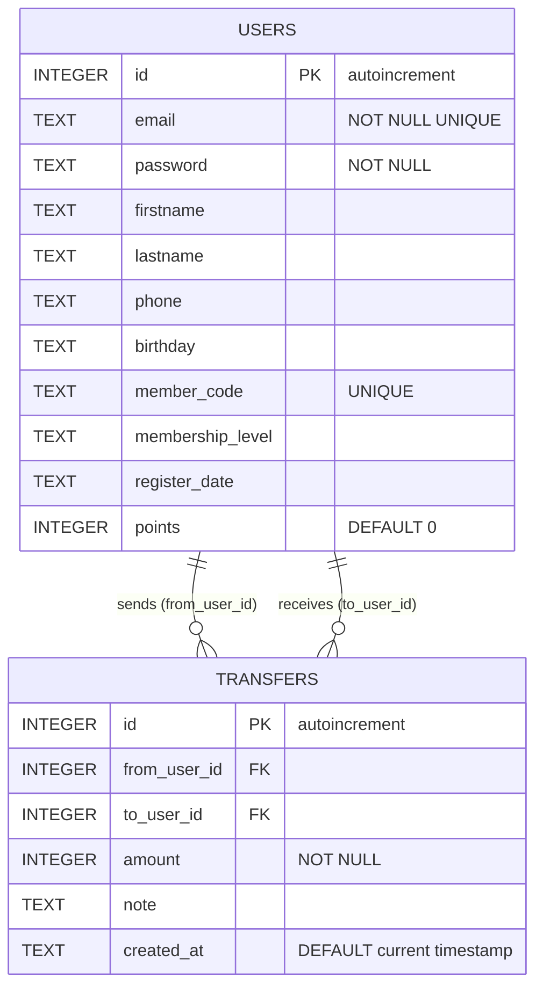

# Database ER Diagram

แผนผัง ER (Mermaid) ที่สร้างจาก schema.sql และ model ในโปรเจค

```mermaid
erDiagram
    USERS {
        INTEGER id PK "autoincrement"
        TEXT email "NOT NULL UNIQUE"
        TEXT password "NOT NULL"
        TEXT firstname
        TEXT lastname
        TEXT phone
        TEXT birthday
        TEXT member_code "UNIQUE"
        TEXT membership_level
        TEXT register_date
        INTEGER points "DEFAULT 0"
    }

    TRANSFERS {
        INTEGER id PK "autoincrement"
        INTEGER from_user_id FK
        INTEGER to_user_id FK
        INTEGER amount "NOT NULL"
        TEXT note
        TEXT created_at "DEFAULT current timestamp"
    }

    USERS ||--o{ TRANSFERS : "sends (from_user_id)"
    USERS ||--o{ TRANSFERS : "receives (to_user_id)"
```
