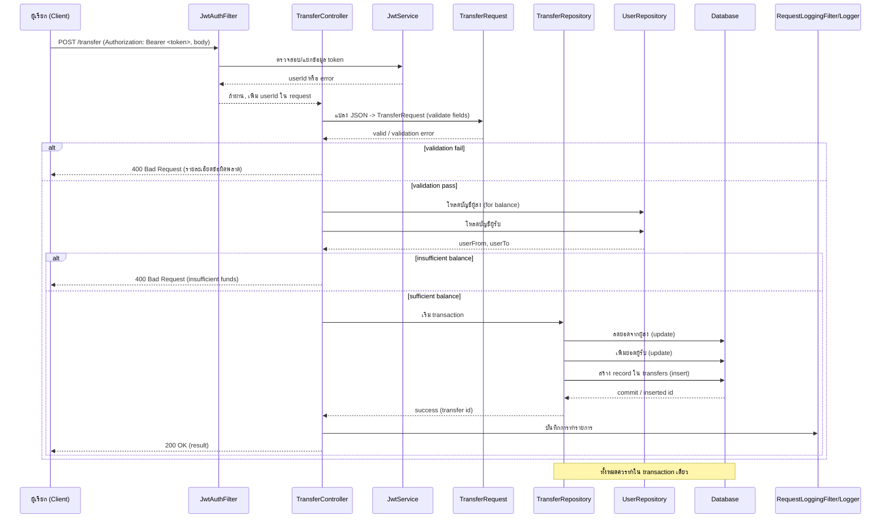

# Transfer API Flow

ไฟล์นี้อธิบายลำดับการทำงานของ API /transfer (POST) ในโปรเจคเป็น Mermaid sequenceDiagram

```mermaid
sequenceDiagram
    participant Client as ผู้เรียก (Client)
    participant Filter as JwtAuthFilter
    participant Controller as TransferController
    participant Service as JwtService
    participant Req as TransferRequest
    participant Repo as TransferRepository
    participant UserRepo as UserRepository
    participant DB as Database
    participant Logger as RequestLoggingFilter/Logger

    Client->>Filter: POST /transfer (Authorization: Bearer <token>, body)
    Filter->>Service: ตรวจสอบ/แยกข้อมูล token
    Service-->>Filter: userId หรือ error
    Filter-->>Controller: ถ้าผ่าน, เพิ่ม userId ใน request
    Controller->>Req: แปลง JSON -> TransferRequest (validate fields)
    Req-->>Controller: valid / validation error
    alt validation fail
        Controller-->>Client: 400 Bad Request (รายละเอียดข้อผิดพลาด)
    else validation pass
        Controller->>UserRepo: โหลดบัญชีผู้ส่ง (for balance)
        Controller->>UserRepo: โหลดบัญชีผู้รับ
        UserRepo-->>Controller: userFrom, userTo
        alt insufficient balance
            Controller-->>Client: 400 Bad Request (insufficient funds)
        else sufficient balance
            Controller->>Repo: เริ่ม transaction
            Repo->>DB: ลดยอดจากผู้ส่ง (update)
            Repo->>DB: เพิ่มยอดผู้รับ (update)
            Repo->>DB: สร้าง record ใน transfers (insert)
            DB-->>Repo: commit / inserted id
            Repo-->>Controller: success (transfer id)
            Controller->>Logger: บันทึกการทำรายการ
            Controller-->>Client: 200 OK (result)
        end
    end

    Note over Repo,DB: ทั้งหมดควรทำใน transaction เดียว
```